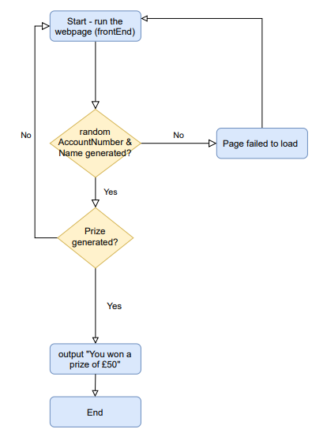

# BankApp
### Abstract
____________________________________________
The BankApp will include a user interface which will allow the user to view a name and account number that is assigned and whenever the account number and name comes together, what prize will they win, depending on what number the account number is starting from. 
### Aim and Objectives
_____________________________________________
The aims and objectives of this projects are as the following:
<table>
  <body>
    <tr>
      <th>Aims </th>
      <th align="center">Objectives</th> 
    </tr>
    <tr>
      <td><ul><li>Use an agile methodology to manage the project</li></ul></td>
      <td align="left"><ul>
          <li>Will use an agile methodology called Asana board to set deadlines for tasks and carry out tasks</li>
          <li>On the Asana board, will create user stories, use cases and tasks which are needed to complete the project</li>
        </ul></td>
    </tr>
    <tr>
      <td><ul><li>Create a design which describe the architecture of the  BankApp</li></ul></td>
      <td align="left"><ul><li>Will create a list of requirements using the MoSCoW technique</li>
        <li>Will draw diagrams such as the ERD, use case diagrams, CI/CD pipelines, workflow and wireframes</li>
        <li>Will carry out risk assessement to demonstrate the potential risks within this project</li>
        </ul></td>
    </tr>
    <tr>
      <td><ul><li>Create a working BankApp which consists  of 4 services</li></ul></td>
      <td align="left">
      <ul><li>Will be using programming languages such as C# and incorporate angular</li>
      </td>
    </tr>
    <tr>
      <td>
        <ul>
          <li>create a working front end functionality  BankApp</li>
        </ul>
      </td>
      <td align="left"><ul>
          <li>Will be using ASP.NET, HTML and CSS to create the front end, allowing the users to interact with the BankApp</li>
        </ul></td>
    </tr>
    <tr>
      <td>
        <ul>
          <li>Testing for the BankApp</li>
        </ul>
      </td>
      <td align="left"><ul>
          <li>Carry out unit testing and automated testing to validate the application</li>
           <li>Provide consistent reports and evidence using a TDD approach</li>
        </ul></td>
    </tr>
     <tr>
      <td>
        <ul>
          <li>Integrate the code for the BankApp</li>
        </ul>
      </td>
      <td align="left"><ul>
          <li>Contionous integration of the code into a VCS (Version Control System) using the Feature-Branch model</li>
           <li>Deploy the BankApp to a cloud-based virtual machine through a CI server through GitHub Actions and Azure App Services</li>
        </ul></td>
    </tr>
  </body>
</table>

### Project Tracking tool
_______________________________________________________
For my BankApp project, I used an Asana board to create user stories (which explains the existence of each functonality and what benefit will it bring to us) and tasks which will make it easier for me to follow the project specifications. Below is my Kanban Board that shows the tasks I have to do, the tasks I am doing currently, testing and lastly the tasks I have completed successfully. I have also added a tool section in my Kanban board to show which tools I have used in this project. User stories have also been implemented and have been labelled. To view my trello board, please click on this link https://app.asana.com/share/avanade/bankapp/9006878344988/e7c9f6fc85811394dccd83c613866273

### Functional and Non-functional Requirements 
_______________________________________________________________________
The table below shows the requirements of the project using the MoSCoW technique where I will be prioritising requirements.
<table>
  <body>
    <tr>
      <th align="centre">Must Have </th>
      <th align="centre">Should Have</th> 
      <th align="centre">Could Have</th> 
      <th align="centre">Wont Have</th> 
    </tr>
    <tr>
      <td align= "left">The user must be able to see the accoutn number that is generated</td>
       <td align= "left">The user can view the history</td>
      <td align= "left">The user can register</td>
      <td align= "left">The admin can login</td>
    </tr>
    <tr>
      <td align="left">The user must be able to add the recipes to the Cook Book App</td>
       <td align= "left">The user can add reviews</td>
  <td align= "left">The user can login</td>
  <td align= "left">The admin can manage users E.g. delete, update users</td>
    </tr>
    <tr>
      <td align="left">The user must be able to update the recipes to the Cook Book App</td>
      <td align= "left">The user can update a review</td>
      <td align= "left">The user can validate their username and password</td>
       <td align= "left">The admin can track the users performance E.g datetime user logged in and out</td>
    </tr>
    <tr>
      <td align="left">The user must be able to delete the recipes to the Cook Book App</td>
      <td align="left">The user can delete a review</td>
      <td align="left"></td>
       <td align= "left">The admin can manage reviews.E.g delete reviews</td>
    </tr>
</table>

### Service Architect diagram 
_________________________________________________________________

  

### CI/CD Pipeline
____________________________________________________________________
  

  
 ### WorkFlow Diagram
____________________________________________________________________
  

### Entity diagram 
________________________________________________________________________

  

### Front End of the App
____________________________________________________________________

### Testing Report
_________________________________________________________________________

xUnit tests were used to run the tests for the BankApp. xUnit test is a unit testing tool which is mainly designed for the .NET framework. The BankApp I have created runs on .NET framework and is a console MVC app. The reason why I used xUnit testing is to compile the code and to detect problems during the early phase of developing the app before actually deploying the app. For the BankApp, I have tested all of my controllers and actions as shown on the screenshot below. However, some of the actions returned null which resulted in some of my tests failing. I used a structure to write my code for testing which was to start off with arranging the test then performing the action and lastly asserting it. I also created Moqs, interfaces and repositories to help me test the controllers of the BankApp.

### Risk Assessement 
____________________________________________________________________________

### Revisits - Updated Version of diagrams after the implementation 
_______________________________________________________________________________________________

In this project. I was able to implement the must requirements which was stated in the project requirements section on this documentation previously. I was also able to implement other requirements too. 

The following requirements that have been implemented in this project are:
* The user must be able to view recipes 
* The user must be able to add recipes 
* The user must be able to edit recipes
* The user must be able to delete recipes
* The user must be able to add reviews 
* The user must be able to view reviews

I was unable to implement the database to the BankApp, therefore I do not have an updated version of the ERD. 

Below is an updated version of my Service Architecture Diagram. 

  
Below is an updated version of my Kanban board. I have completed all of the required tasks successfully. However, was unable to create a prototype for the CookBookApp as I ran out of time. 

### Evaluation 
_________________________________________________________________

The strengths of this project were that:
* I was able to use a Trello Kanban Board successfully.
* I was able to complete the CRUD functionality successfully and was able to link the two tables on the database successfully. For example, I was able to retrieve the RecipeID in my Reviews table in the database and was able to add reviews and views for a certain recipe. 
* I was able to use ASP.NET, HTML and CSS as my front end and back end. 
* I was able to connect the workBench with AzureMySql and ASP.NET
* I was able to test both of my recipes and reviews controller and generated a report for them to show the overall test coverage 
* I was able to deploy my app through the Azure App Service and publishing the app on visual studio, allowing me to perform continous integration as shown below on the screenshot:

* I was able to re-create all of my diagrams and revisit them to compare what I had before the implementation and after the implementation, allowing me to suggest future work that may be required for the app by using the MoSCoW technique. 
* I was able to carry out the risk assessements and I also revisited the risks to see how I mitigated the risk 
* I was able to push my CookBookApp code to the github successfully.
* I was able to use all of the tools that I learnt during the training and apply them to my project.

The weaknesses of this project were that:
* I was not able to deploy the app through the Azure pipelines as the build failed, therefore had to use an alternative way to deploy the CookBookApp. However, I was able to build the code and create a YAML file but was unable to deploy the app unsuccessfully as shown below:

* I was not able to do alot of work on the front end of the side to make the app look prettier and more user friendly. 

Further improvements:
* Test the whole code and increase the code coverage report percentage 
* Create a prototype for the CookBookApp
* Work on making the app look more user friendly. For example, when the user adds recipe to the app, the description textarea should be bigger allowing them to add a detailed description without any hassle.
* Deploy the app through Azure pipelines
* Implement the should have, could have and wont have requirements of this project in the future 
* Include validations. For example, if the user enters a text rather than a number in the number of serving part, then it should prompt a user with a message stating them to enter a valid number. Also, create validations for empty forms. For example, if the form is left empty and user clicks save, it wont submit or add to the database as all fields should be mandatory to be filled in. 
* Use Angular for the front end to integrate it with ASP.NET.

### Authors
_________________________________

Samia Iqbal
