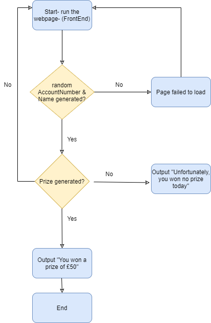

# BankApp
### Abstract
____________________________________________

A page on the web service App will be loaded and will generate a prize when both the Account Number and Name comes together. The prize that the user wins and the account number that they were assigned should be saved into the database which will act as an history page on the front end service. Below is a table which demonstrates the user journey, showing when can a user win a prize and what type of prize do they win, this will be dependant on the first number of the account number. I will be working with 4 services and will connect them with an API. Service one is the front end of the app which will be created using ASP.NET MVC. Service two is the Account numbers service which will generate the account number randomly. Service three is the Names service which will generate the names randomly. Lastly, service four is the merge service which will combine both service two and three together and based upon that, a prize will be generated as shown below.

* Service one is Front End service 
* Service two is Account Number service 
* Service three is Names service 
* Service four is the Merge service 

### WorkFlow-User Journey 
_____________________________________________

The workflow below shows how the user will be interacting with the system.

### Aim and Objectives
_____________________________________________
The aims and objectives of this projects are as the following:
<table>
  <body>
    <tr>
      <th>Aims </th>
      <th align="center">Objectives</th> 
    </tr>
    <tr>
      <td><ul><li>Use an agile methodology to manage the project</li></ul></td>
      <td align="left"><ul>
          <li>Will use an agile methodology called Asana board to set deadlines for tasks and carry out tasks</li>
          <li>On the Asana board, will create user stories, use cases and tasks which are needed to complete the project</li>
        </ul></td>
    </tr>
    <tr>
      <td><ul><li>Create a design which describe the architecture of the  BankApp.</li></ul></td>
      <td align="left"><ul><li>Will create a list of requirements using the MoSCoW technique</li>
        <li>Will draw diagrams such as the CI/CD pipeline, Service Architect diagram, ERD diagram, wireframes of how the app will look like and the work flow diagram</li>
        <li>Will carry out risk assessement to demonstrate the potential risks within this project</li>
        </ul></td>
    </tr>
    <tr>
      <td><ul><li>Create a working BankApp which consists  of 4 services</li></ul></td>
      <td align="left">
      <ul><li>Will be using programming languages such as C#, HTML, CSS and web API to connect the 4 services, and for the back end will be using AzureMySQL to save the history of the prizes that were won by different users</li>
      </td>
    </tr>
      <td>
        <ul>
          <li>Testing for the BankApp</li>
        </ul>
      </td>
      <td align="left"><ul>
          <li>Carry out xUnit testing and automated testing to validate the application</li>
           <li>Provide a generated report for testing and show the test coverage</li>
        </ul></td>
    </tr>
     <tr>
      <td>
        <ul>
          <li>Deployment and Integrate the code for the BankApp</li>
        </ul>
      </td>
      <td align="left"><ul>
         <li>Use terraform to deploy Azure App Services and databases</li>
          <li>Contionous integration of the code into a VCS (Version Control System) using the Feature-Branch model, make use of different branches and merge them, showing a change in one branch and merging it with the master and redeploy to demonstrate that the work flow is working successfully</li>
           <li>Deploy the BankApp to a cloud-based virtual machine through a CI server through GitHub Actions and Azure App Services</li>
        </ul></td>
    </tr>
  </body>
</table>

### Project Tracking tool
_______________________________________________________
For my BankApp project, I used an Asana board to create user stories, a doing section, done section, testing section, design section, coding section and lastly deployment section. This allowed me to carry out the tasks easily for this project. The user stories were also demonstrated on the Asana Board , please click on this link https://app.asana.com/share/avanade/bankapp/9006878344988/e7c9f6fc85811394dccd83c613866273

### Functional and Non-functional Requirements 
_______________________________________________________________________
The table below shows the requirements of the project using the MoSCoW technique where I will be prioritising requirements.
<table>
  <body>
    <tr>
      <th align="centre">Must Have </th>
      <th align="centre">Should Have</th> 
      <th align="centre">Could Have</th> 
      <th align="centre">Wont Have</th> 
    </tr>
    <tr>
      <td align= "left">The user must be able to see an account number and a name randomly generated together and show what prize hey won, according to the starting number of the account number</td>
       <td align= "left">The user can view the history of the account numbers and prizes that the users won</td>
      <td align= "left">Input validation - For example, one user can win only one prize</td>
      <td align= "left">The admin can login and manage the users and the account numbers they were assigned to</td>
    </tr>
   
</table>

### Service Architect diagram 
_________________________________________________________________

  The service Architect diagram illustrates how the services interact with each other. 

  

### CI/CD Pipeline
____________________________________________________________________
 
 The CI/CD pipeline shows how the user builds the system and what happens at each stage.  For example, as you can see that through gitHub, an automated workflow is build which will allow the user to perform continous integration whenever they re-deploy the BankApp. 
  

  

### Entity diagram 
________________________________________________________________________

The ERD diagram belows how the tables will interact with one another on the database. There is a one to many relationship between the accountNumber table and Merge table, and there is also a one to many relationship between the Names table and the merge table. This demonstrates that the merge table can have many names and account numbers, which is the whole point of this table, to display the history of the account number and names that were generated, and what prize did they win. 
  

### Front End of the App
____________________________________________________________________

Below is a demo of how my app looks before I make the change to the BankApp. I will show you this in my live demo when I do my presentation of how the background colour changes, showing that the automated workflow does work. 

Below is a demo of my app after the implementation change had been made. 
  

### Testing Report
_________________________________________________________________________

xUnit tests were used to run the tests for the BankApp. xUnit test is a unit testing tool which is mainly designed for the .NET framework. The reason why I used xUnit testing is to compile the code and to detect problems during the early phase of developing the app before actually deploying the app. For the BankApp, I have tested all of my controllers and actions as shown on the screenshot below. I used a structure to write my code for testing which was to start off with arranging the test then performing the action and lastly asserting it. In all of my controllers, I have managed to get 100% in all controllers successfully and overall attained 75.4% inline coverage as shown below. 

  
### Terraform
_________________________________________________________________________

I used Terraform to build and deploy the 4 Azure App services. I used a foreach loop which allowed me to deploy all 4 app services in one go as shown below:

### Risk Assessement 
____________________________________________________________________________

Below is the risk assessment table which shows the potential risks that did take place when creating the BankApp. 

### Revisits - Updated Version of diagrams after the implementation 
_______________________________________________________________________________________________

In this project. I was able to implement the must requirements which was stated in the project requirements section on this documentation previously and that was to allow the user to see the account number and the name generated randomly, and what prize they won, according to the starting number of the account number. 
  
I was unable to implement the database to the BankApp, therefore I do not have an updated version of the ERD. However, I was able to implement the WorkFlow diagram inside my project successfully.

Below is an updated version of my Service Architecture Diagram. 

  
Below is an updated version of my CI/CD Pipeline. 

  
Below is an updated version of my Asana board. I have completed all of the required tasks successfully. However, was unable to create a prototype for the BankApp as I ran out of time. 

### Evaluation 
_________________________________________________________________

The strengths of this project were that:
* I was able to use a Asana Board successfully.
* I was able to complete the must requirements of this project successfully. 
* I was able to use API, service architecture, terraform, ASP.NET, C#, HTML and CSS. 
* I was able to test all the controllers for all four services successfully and managed to generated a report coverage for testing, which showed that my app is trust worthy and ready to use as I got 100% in all tests. 
* I was able to use terraform successfully and used it to deploy the Azure App services, as well as configuring it. 
* I was able to deploy my app through the Azure App Service and GitHub Actions through publishing the bankApp on visual studio, allowing me to perform continous integration as shown below on the screenshot:

* I was able to re-create all of my diagrams and revisit them to compare what I had before the implementation and after the implementation, allowing me to suggest future work that may be required for the app by using the MoSCoW technique. 
* I was able to carry out the risk assessements and I also revisited the risks to see how I mitigated the risk 
* I was able to push my BankApp code to the github successfully.
* I was able to use all of the tools that I learnt during the training and apply them to my project.

The weaknesses of this project were that:
* I was not able to use database to show the history of the prize won and account number and names that were generated randomly. 
* I was not able to do alot of work on the front end of the side to make the app look prettier and more user friendly. 

Further improvements:
* Create a prototype for the BankApp
* Deploy the app through Azure pipelines DevOps
* Product one YAML file 
* Implement the should have, could have and wont have requirements of this project in the future 
* Use Angular for the front end to integrate it with ASP.NET

### Authors
_________________________________

Samia Iqbal
